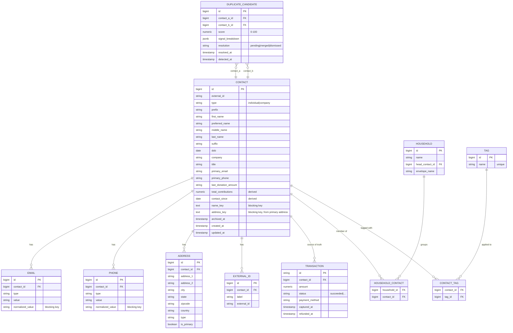
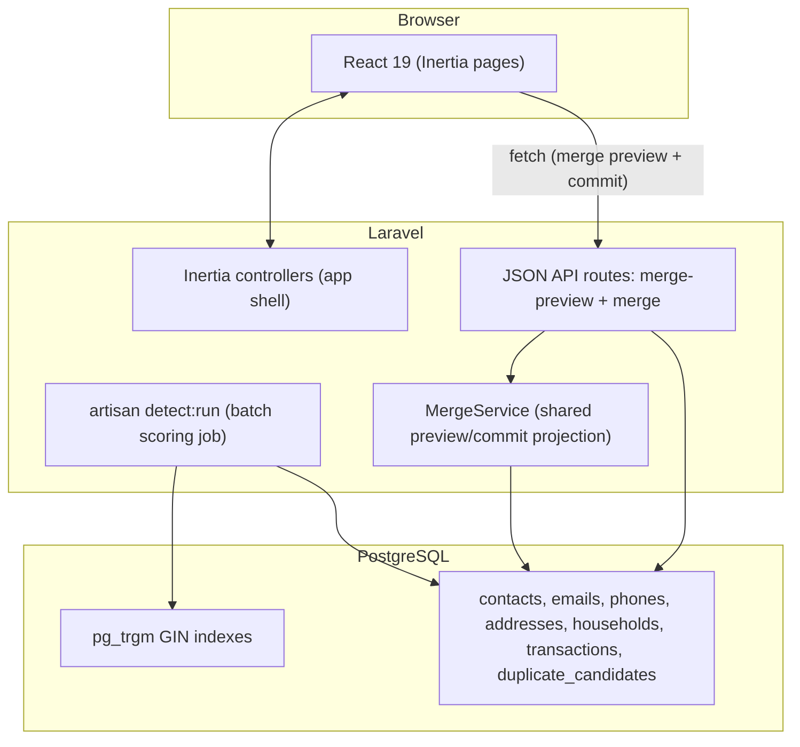

# Givebutter VVP — "Detect" Prototype

A proactive data-trust layer for agentic CRM. This prototype builds **Detect**: a multi-signal weighted duplicate matcher with a merge preview that shows how giving history recomputes *before* anything commits.

---

## 📋 Table of Contents

- [Problem Statement](#-problem-statement)
- [Target Users](#-target-users)
- [Scope](#-scope)
- [Features](#-features)
- [Data Architecture](#-data-architecture)
- [Detection Algorithm](#-detection-algorithm)
- [API Surface](#-api-surface)
- [Tech Stack](#-tech-stack)
- [UI/UX Guidelines](#-uiux-guidelines)
- [Demo Seed Data](#-demo-seed-data)
- [Testing](#-testing)
- [Deliverable](#-deliverable)
- [Project Structure](#-project-structure)
- [Next Steps](#-next-steps)

---

## 🎯 Problem Statement

Givebutter is shipping **agentic CRM**. Agents that *act* on records — not just read them — require a higher data-trust bar than the current CRM was designed for. Reactive fixes to data-trust bugs — like a household-email mis-merge, where a naive exact-match rule proposes collapsing two different people who share an inbox, and a reviewer with no reason to doubt it clicks Merge — are the failure mode. The opportunity is a **proactive trust layer** that sits *before* agents ship.

**Pitch through-line: _Detect → Score → Gate._**

| Pillar | What it is | This VVP |
| ------ | ---------- | -------- |
| **Detect** | Smarter duplicate detection + safe merge | ✅ **This prototype** |
| **Score** | Per-contact Trust Score | Deck only |
| **Gate** | Agent pre-flight check before an action commits | Deck only |

**A telling gap:** Givebutter's API has endpoints to create, update, archive, restore, and household-link contacts — but **no merge action exists** (verified against `docs.givebutter.com`). Actions are a pattern the API already uses: `PATCH /v1/contacts/{contact}/restore`, plus `POST /v1/contacts/{contact}/tags/add`, `/tags/remove`, and `/tags/sync` — non-CRUD operations hanging off the contact with the verb in the path. Merge belongs in that list and isn't in it; it's a destructive, high-trust operation that today happens only in the UI, on pairs a naive rule proposed. That's exactly the gap a trust layer should own. This prototype builds the matcher *and* the review gate that should sit on top of the existing dedupe.

**One-liner:** A multi-signal weighted matcher with a merge preview that shows how giving history will change before anything commits.

**Demo moment:** Watch `contact_since` correct itself in real time when you merge **Jennifer + Jen**.

---

## 👥 Target Users

| User Type | Primary Need |
| --------- | ------------ |
| **Nonprofit data admin** | Trust that a merge won't silently corrupt lifetime giving or donor tenure |
| **Development / major-gifts officer** | Accurate `total_contributions` and `contact_since` for stewardship |
| **Givebutter platform team** | A safe, auditable merge primitive that agentic features can call |
| **(Future) CRM agent** | A gated, reversible merge action it can propose but not blindly commit |

---

## 🧭 Scope

Weekend-scoped. Scope is a set of **decisions**, not gaps — each "out" below was deliberately cut.

### Signals: stored vs. scored (bridge to the deck)

The deck's claim — *Givebutter's schema already stores **6 identity signals***  — is accurate (verified against `docs.givebutter.com`). This prototype is a deliberate subset that **acts** on them:

| # | Stored signal (deck) | Schema backing | Prototype role |
| - | -------------------- | -------------- | -------------- |
| 1 | Preferred-name | `preferred_name` (+ `first_name`/`last_name`) | **Primary** — preferred-name-aware fuzzy name match |
| 2 | Multi-email | `emails[]` | **Primary** — any-to-any cross-field match |
| 3 | Multi-phone | `phones[]` | **Primary** — any-to-any cross-field match |
| 4 | Addresses | `addresses[]` | **Primary** — trigram address similarity |
| 5 | External IDs | `external_ids[]` | **Deferred** (mirrored, not matched) — the weekend cut line |
| 6 | Household | `households` + join (`head_contact_id`) | **Modifier** (asymmetric, not additive) |

> Narrative: *"The schema already stores six identity signals. This prototype scores on four, uses household as a context modifier, and defers external-ID matching — that's the cut line for a weekend."* Scope reads as a decision, not a gap.

### ✅ In scope

**Matching — 4 primary signals + 1 modifier**

| Signal | Behavior |
| ------ | -------- |
| Cross-field email match | Any-to-any across the `emails[]` array, not just `primary_email` |
| Cross-field phone match | Any-to-any across the `phones[]` array |
| Fuzzy name match | Preferred-name aware (`Jen` ≈ `Jennifer`); nickname-table primary + trigram for typos |
| Address similarity | Trigram over normalized `address_1 + city + zipcode` |
| **Household co-membership** | **Asymmetric _modifier_, not an additive signal** — see [Detection Algorithm](#-detection-algorithm) |

**Safe merge**

- Three-tier field resolution (pick scalars / union arrays / recompute derived)
- System-proposed survivor with user override
- Loser **soft-deleted** (mirrors Givebutter's reversible `DELETE` + `restore`, not a hard delete); transactions **re-pointed** to survivor

**Derived-field reconciliation — 3 fields recomputed from source-of-truth transactions**

- `stats.total_contributions`
- `contact_since`
- `last_donation_amount`

### ❌ Out of scope (deliberately)

| Cut | Why |
| --- | --- |
| `external_ids[]` matching | Would be a 5th signal; skip for weekend scope (field still mirrored) |
| Custom-fields matching | Low signal, high schema variance |
| Segment recomputation after merge | Out of the trust-critical path |
| Tag-union diffing UI | Tags auto-union silently; not a decision surface |
| Activity-feed merge | Not trust-critical for the demo |
| Rollback / undo feature | The loser is soft-deleted rather than destroyed, but the commit re-points transactions and overwrites survivor scalars in place without logging what moved — a real un-merge needs that audit trail, which is the actual cost and is out of weekend scope |
| Transitive clustering | Candidates are strictly **pairwise** (A≈B and B≈C → two independent queue items, not a 3-way cluster); connected-component clustering deferred |
| Block-size cap / degenerate-value guards | Documented in the algorithm, not implemented — the synthetic seed doesn't trigger them |
| Company-contact merges | Givebutter doesn't support merging these either |
| Real authentication | Stubbed to a seeded admin — see [Tech Stack](#-tech-stack) |

---

## ✨ Features

### A. Review Queue
Ranked list of candidate duplicate pairs, each showing a 0–100 confidence score and a **per-signal "why"** breakdown (which signals fired, with their contributions). Sorted highest-confidence first. Reads from a precomputed candidates table.

### B. Merge Review (single screen: preview + picker + before/after)
- **Side-by-side diff** of the two contacts.
- **Per-field primary picker** — shown *only* for scalar fields that actually conflict (identical values are hidden; they aren't decisions).
- **Array fields** (`emails`, `phones`, `addresses`, `tags`, `external_ids`) auto-union with dedupe, rendered as a read-only "kept both" summary.
- **Before/After panel** — read-only, shows how the 3 derived fields recompute from transactions. This is the demo payoff.

### C. Safe Commit
- System proposes the **survivor** = the **more complete / most recently updated record** (tie-break on higher `total_contributions`). The richer record is kept. User can override with a clearly-marked toggle.
  > Donor tenure is **not** a survivor concern — `contact_since` is recomputed as `MIN(captured_at)` over the *union* of both contacts' transactions regardless of who survives. This is also what makes the demo land: keeping the richer record (Jennifer, later `contact_since`) and folding in the loser (Jen, earlier transaction) drags `contact_since` *backward* on commit. If the survivor already held the earliest date, nothing would visibly change.
- On commit, inside **one DB transaction**: loser gets `archived_at` set, all loser transactions re-point to the survivor, derived fields recompute, survivor scalar/array fields update per the picker/union rules.
- **"Not a duplicate" dismiss** — the other outcome from the Merge Review screen. Removes the pair from the queue and records it as a **labeled negative** (the same confirmed-history signal that would train the scoring weights and Trust Score in production). Below-threshold pairs (Ignore band, e.g. parent/child ≈ 35) never enter the queue, so there is no "open a non-confident pair" flow — the system simply doesn't surface them.

### D. The "current rule misses this" cases
Two seeded scenarios prove the prototype beats the naive rule in both directions — see [Demo Seed Data](#-demo-seed-data).

---

## 🗄️ Data Architecture

Mirrors Givebutter's real schema (verified against `docs.givebutter.com`). The app stores its own normalized tables; the public-API resource shapes are mirrored so the prototype reads as production-shaped.

### Entity Relationship Diagram



### Field mirroring notes (from the real API)

- `stats` in the API only carries `total_contributions` and `recurring_contributions` (both strings) — there is **no donation count**. We store `total_contributions` as a derived numeric.
- `contact_since` and `last_donation_amount` are top-level on the contact. The real API treats `contact_since` as **writable** — it's an accepted `PUT /v1/contacts/{contact}` body field, settable to any date with nothing recomputing it. This prototype treats both as **derived** (recomputed from transactions), never free-text. The divergence is deliberate: it's the trust gap the pitch names.
- `emails[]` / `phones[]` are `{type, value}` only. The `normalized_value` column alongside each is ours, not the API's — it's what the exact-match blocks self-join on.
- `contacts.name_key` / `contacts.address_key` are likewise prototype-only: precomputed normalized blocking keys, written by the Normalizer during seeding and `detect:run`. Keeping `address_key` on `contacts` (derived from the primary address) means both fuzzy blocks index one table.
- `tags` are a flat array of strings (max 64 chars each) on the create/update request; the API exposes dedicated add/remove/sync endpoints. Normalized here to `tags` + `contact_tags` so the merge can auto-union them. **Never matched on and never diffed** — they exist only to survive a merge.
- `AddressResource` fields: `address_1`, `address_2`, `city`, `state`, `zipcode`, `country`, `type`, `is_primary`.
- Households use `head_contact_id` to mark the head; there is **no per-member relationship label** in the real schema, so the modifier keys off co-membership + head designation, not an invented role.
- `TRANSACTION.captured_at` (not `created_at`) is the settlement timestamp used for `contact_since`; `refunded_at` / `status` drive the recompute filter.
- The contact API exposes **`DELETE` + `PATCH /restore`** (a reversible **soft-delete** — `ContactResource` carries `archived_at`, and there is no `deleted_at`) and **no merge action** — verified against `docs.givebutter.com`. The merge loser is modeled as a soft-delete (internal `archived_at`, mirroring the API's own field name) rather than a hard delete, matching how the API treats a removed contact; **merge is the trust-critical primitive the API doesn't yet own.**

### `duplicate_candidates` (prototype-only)
Precomputed by the `detect:run` artisan command. `signal_breakdown` is JSON: per-signal score contribution + the matched values, so the UI can render *why* without recomputing.

`resolution` (`pending` → `merged` | `dismissed`) carries the queue state. The Review Queue shows only `pending` rows; a merge marks the pair `merged`, and "Not a duplicate" marks it `dismissed` — **the labeled negative that would train the scoring weights in production.** Resolved rows are kept, not deleted, which is why the pair's relationships must still resolve an archived merge loser.

> **Delivery note:** this table is real and central, but the Review Queue reads it via an **Inertia prop** (the controller queries it and passes ranked pairs into the page) — not a JSON endpoint. See the [Partial API split](#-api-surface): only the two merge actions are exposed as JSON routes; the queue and contact reads ride Inertia. The `detect:run` batch-precompute story is unchanged.

---

## 🧮 Detection Algorithm

### Candidate generation — blocking, not O(n²)

Scoring every pair is 100k²/2 ≈ 5B comparisons (infeasible, and ~all pairs are obvious non-matches). Instead, **blocking**: generate only candidate pairs that share a cheap blocking key, union them, dedupe (canonical ordered pair `a.id < b.id`), then score that small set.

| Block | Mechanism | Cost |
| ----- | --------- | ---- |
| Exact normalized email | self-join on normalized `emails[].value`, btree index | O(matches) |
| Exact normalized phone | self-join on normalized `phones[].value`, btree index | O(matches) |
| Trigram-similar name | GIN `gin_trgm_ops` index + `%` operator (`a.name_key % b.name_key`) | ~O(n·k) |
| Trigram-similar address | GIN `gin_trgm_ops` index on normalized address key + `%` | ~O(n·k) |
| Same household | join on `household_contacts` | tiny |

The GIN trigram index + `%` operator is what keeps the fuzzy blocks sub-quadratic: Postgres probes only rows above `pg_trgm.similarity_threshold` per row — it never materializes the full cross product. This is the SQL story the `EXPLAIN ANALYZE` artifact proves (index scan, not nested-loop-over-everything). Target: sub-100ms candidate generation at ~100k contacts.

> **Hero-case dependency (don't drop the pair):** Jennifer/Jen have *different* emails and phones, and trigram(`jen`,`jennifer`) ≈ 0.3 sits right at the threshold — so the name block is unreliable for them. The **same-household block is what reliably generates this candidate pair.** Build implication: either rely on the household block (the pair must be seeded into a shared household — it is) **or** apply nickname expansion at the *blocking* stage too, not only at scoring. Don't let candidate generation silently drop the headline demo pair.

> **Noted, not built (production hardening):** two guards matter on adversarial real data but aren't triggered by the synthetic seed, so they're documented rather than implemented — (1) skip degenerate blocking values (`NULL`/blank, shared `info@` inboxes, `(000) 000-0000`); (2) cap block size (a value shared by > ~50 contacts is non-discriminating — skip it rather than emit N² pairs).

### Normalization (deterministic, applied before blocking + scoring)

| Field | Rule |
| ----- | ---- |
| Names | lowercase, `unaccent`, strip non-alpha, collapse whitespace → normalized name key |
| Nicknames | small **diminutive/alias table** (Jen↔Jennifer, Bob↔Robert, …); name agreement = max over { exact normalized, nickname-expanded match, trigram similarity } |
| Emails | lowercase + trim (plus-addressing/gmail-dot canonicalization noted as future, not built) |
| Phones | strip to digits, compare on last 10 (US) — E.164 normalization is the production form |
| Addresses | lowercase, `unaccent`, strip punctuation, collapse whitespace; key = `address_1 + city + zipcode`; rely on trigram |

> **Why the nickname table matters:** trigram similarity of `jen` vs `jennifer` is only ~0.3–0.4 (borderline at the default threshold). The nickname table is what makes the Jennifer/Jen hero case match *reliably* rather than by luck — and it's a defensible, explainable design choice over tuning thresholds until the demo happens to pass.

### Scoring — weighted signal scoring
- Weighted sum of per-signal agreement scores with **hand-tuned weights** — each signal contributes points toward a match, and stronger identity signals weigh more.
- Output: a **0–100 confidence score** per candidate pair.
- Per-signal contributions are surfaced in the API response (`signal_breakdown`) so the UI shows *why* a pair was flagged.

> **Honesty note:** Weights are hand-tuned so the two hero cases land correctly — they are not learned. **In production they'd be learned directly from Givebutter's confirmed-merge history** — every past merge is a labeled positive pair, which is exactly the training signal a probabilistic record-linkage model (e.g. Fellegi-Sunter with EM-estimated m/u priors) would consume. Called out as the honest next step rather than overclaimed as implemented here.

### The household modifier (the centerpiece)

Shared household membership is **double-edged**, and handling it correctly is the entire pitch:

- In the **Jennifer/Jen** case, shared household membership is *evidence they're the same person*.
- In the **parent/child** case, a shared household **email** is exactly what makes the naive rule *wrongly* propose merging two different people.

So household is modeled as an **asymmetric context modifier**, not an additive signal:

| Condition | Effect on score |
| --------- | --------------- |
| Shared household **+ shared email** | **Dampen** the email signal's weight (families share inboxes — a shared email is weak evidence inside a household) |
| Shared household **+ strong name agreement + `dob` agreement** | **Boost** confidence (same household *and* same identity markers → likely the same person) |
| Shared household, conflicting `dob` | Push **toward "different people"** even if email matches |

`dob` is already in the real schema, so it's a zero-cost disambiguator — it's the field that separates parent from child when everything else (household, surname, address) collides. This single rule lets the prototype get **both** hero cases right where the naive rule fails one in each direction.

### Confidence bands

The 0–100 score routes a pair into one of three bands (configurable constants, tuned against confirmed-merge history in production — same honesty caveat as the scoring weights):

| Band | Score | Behavior |
| ---- | ----- | -------- |
| **Auto-merge** | ≥ 90 | (Future / Gate) agent-eligible. In this prototype: still enters the queue, flagged "high confidence — agent-eligible" |
| **Review** | 60–89 | Surfaced in the review queue for a human decision — **this prototype's job** |
| **Ignore** | < 60 | Not shown; below this it's noise |

Hero-case seed targets: **Jennifer/Jen ≈ 94** (flagged-high band), **parent/child ≈ 35** (below 60, never surfaced).

### Relationship to Score & Gate (not prototyped)

Match confidence is **not** the Trust Score, and the bands are not a duplicate of it:

- **Match confidence** grades a **pair** ("are these the same person?"). The Trust Score grades a **single record** ("is this record safe for an agent to act on?").
- The two are connected one-way: an unresolved high-confidence duplicate is an **input that lowers** a contact's Trust Score — a record that might be two people is inherently less safe to act on. Detect *feeds* Score; it doesn't replace it.
- The **auto-merge band is exactly where Gate sits**: even a ≥90 match shouldn't merge autonomously unless Gate's pre-flight check clears it. Gate reads two inputs: the trust score (is this record safe to act on?) and the action's consent status (is this send permitted?). Only the first needs building: consent is already published on the contact resource (`is_email_subscribed`, `email_opt_in`, `address_unsubscribed_at`, …) and simply isn't consulted. Three gates, three units: pair (Detect), record (Score), action (Gate).

---

## 🔌 API Surface

Candidates are **precomputed** (batch), not scored synchronously per request — both faster and a more honest production architecture (real systems run scoring as a job, not on page load).

| Delivery | Route / mechanism | Purpose |
| -------- | ----------------- | ------- |
| **Inertia prop** | Review Queue page | Ranked pairs + `signal_breakdown` from the precomputed `duplicate_candidates` table |
| **Inertia prop** | Merge Review page | Full contact records (with arrays) for both sides of the preview |
| **JSON API** | `GET /api/contacts/merge-preview?survivor={id}&loser={id}` | **Dry run** — returns the projected merged record + projected derived values, commits nothing. Powers the before/after panel |
| **JSON API** | `POST /api/contacts/merge` | **Commit** — survivor, loser, and per-field picker choices; runs in a DB transaction |

> **Partial API split (deliberate):** the read-only screens receive their data as **Inertia props** — no fetch layer where it isn't earning anything. Only the **two merge actions** are real JSON API routes, because *that* is where the API design is the artifact an async reviewer reads: a dry-run `GET` and a committing `POST` sharing one projection. Reviewers get the repo async, so the API budget is spent only where the design is legible in code, not on plumbing reads Inertia serves for free.

> **Shared projection logic:** `merge-preview` and `merge` call the *same* projection code (`commit=false` vs `commit=true`), so what the user previews is exactly what commits.

**Batch command:** `php artisan detect:run` scores all candidate pairs and (re)populates `duplicate_candidates`.

---

## 🛠️ Tech Stack

Mirrors Givebutter's real production stack.

### Architecture Diagram



### Architecture decision: Inertia shell + real JSON API for the two merge actions only

The app shell uses **Inertia + React** (Laravel serves the React pages over the shared session — no CORS, no bearer plumbing), and the read-only screens (Review Queue, contact preview) receive their data as **Inertia props**. Only the **two merge actions** — `merge-preview` and `merge` — are exposed as **real JSON API routes**, because that is where the API design is itself the artifact: a dry-run `GET` and a committing `POST` sharing one projection is a design an engineer reads directly from the source. Reviewers get the repo **async**, so there's no live Network tab to demo — the budget goes only where the design is legible in code, not on wrapping reads Inertia serves for free.

### Technology Choices

| Category | Technology | Notes |
| -------- | ---------- | ----- |
| **App shell** | Laravel + Inertia 2 | Shared session, no CORS; official React starter kit |
| **Frontend** | TypeScript, React 19, Vite | Inertia pages + `fetch` to the JSON API |
| **Backend** | PHP, Laravel | Mirrors Givebutter's real stack |
| **Database** | PostgreSQL | Chosen for `pg_trgm` trigram indexing — clean SQL story for fuzzy matching |
| **Styling** | Tailwind v4 + shadcn/ui | CSS-first `@theme` tokens; light-themed to Givebutter (see UI/UX) |
| **Tests** | Pest / PHPUnit | Scoring + recompute only |

### Authentication
**Skipped.** A seeded "demo admin" user is auto-logged-in via middleware (`Auth::user()` resolves to the seeded user). No login or registration screen.

> **Demo note:** Auth is stubbed to a seeded admin. In production this sits behind Givebutter's existing org-scoped auth, and merge would be a permissioned, audited action.

### Setup budget
~2–3 hrs Saturday morning (budget generously — the `pg_trgm` extension and Inertia/Vite wiring can fight you): Laravel + Inertia + Vite + Postgres + `pg_trgm` extension + one health-check page end-to-end, before any feature code.

---

## 🎨 UI/UX Guidelines

**Two screens**, Tailwind + shadcn/ui primitives, **light-themed to Givebutter** (brand palette + fonts + logo via Tailwind theme tokens — ~30 min; do not rebuild their component system). Reads as "belongs in Givebutter" without the time sink.

### Brand tokens

Wire these directly into an `@theme` block in `resources/css/app.css` (Tailwind v4 is CSS-first — no `tailwind.config.ts`). No guessing, no live-site extraction needed.

**Colors**

| Role | Token | Hex |
| ---- | ----- | --- |
| Primary — butter yellow | `brand.yellow` | `#febf04` |
| Primary — near-black | `brand.black` | `#1d1d1d` |
| Primary — accent blue | `brand.blue` | `#1430e1` |
| Primary — white | `brand.white` | `#ffffff` |
| Secondary — purple | `brand.purple` | `#6f57d1` |
| Secondary — pale yellow | `brand.cream` | `#fff3cc` |

**Typography**

| Role | Font |
| ---- | ---- |
| Logo | Nunito Extra Bold |
| Headers | Poppins Semi Bold |
| Body / paragraph | DM Sans Normal |

### Screen 1 — Review Queue
Ranked list of candidate pairs. Each row: both names, confidence score, and a compact per-signal "why" (chips for the signals that fired). Click → Merge Review.

### Screen 2 — Merge Review
```
┌──────────────────────────────────────────────────────────────┐
│  Merge Review          Confidence 94   [ Survivor: Jennifer ▾ ]│
├───────────────────────────────┬──────────────────────────────┤
│  Jennifer Smith   (survivor)  │  Jen Smith   (soft-delete)    │
│  ───────────────────────────  │  ──────────────────────────   │
│  first_name   (•) Jennifer    │  ( ) Jen        ← conflict     │
│  emails       work@… + jen@…  →  union: both kept (read-only)  │
│  phones       (555)…          →  union: both kept (read-only)  │
├───────────────────────────────┴──────────────────────────────┤
│  BEFORE → AFTER (recomputed from transactions)                 │
│  contact_since        2021-06-02  →  2019-03-14  ⚡ highlighted │
│  total_contributions  $1,200.00   →  $1,700.00                 │
│  last_donation_amount $50.00      →  $50.00                    │
│                    [ Not a duplicate ]   [ Cancel ] [ Merge ]   │
└──────────────────────────────────────────────────────────────┘
```

### The one micro-interaction worth polishing
When the before/after panel loads, **flash/animate the `contact_since` value correcting itself** (color highlight on the changed value). That single moment sells the entire pitch — everything else stays plain.

### Design principles
- Credible, not custom. A clean prototype reads as honest.
- Show identical fields as collapsed/hidden — only surface real decisions.
- Toast on successful merge; merge is high-trust, so wait for the server (no optimistic UI).

---

## 🌱 Demo Seed Data

Two **tiers**:

1. **Curated demo set (~2,000 contacts)** — what the live demo runs against. Contains the two hero cases plus realistic noise.
2. **`php artisan seed:bulk` (100k synthetic contacts)** — *(optional / stretch — the core demo and repo stand without it)* for running `EXPLAIN ANALYZE` to screenshot **GIN-index vs seq-scan** timing. Build this only after the core is done and polished; otherwise the performance claim lives as README prose + the legible `CandidateGenerator` query and index migration, which an async engineer can evaluate from source.

### Hero case 1 — Jennifer / Jen (naive rule misses → we catch)
"Jennifer Smith" (work email) and "Jen Smith" (personal email), same household, same `dob`. The naive rule keeps them separate (different emails, different first name). The prototype matches them: fuzzy preferred-name + shared household + `dob` agreement. **Seed Jen with an earlier transaction** so the merge visibly corrects `contact_since` backward — the demo moment. **Seed one refunded transaction** on one of them so `total_contributions` proves the refund-exclusion rule.

### Hero case 2 — Parent / child shared household email (naive rule flags them → we don't)
Parent and child share a household email and surname and address. Givebutter's duplicate scan matches on primary email regardless of names, so it **wrongly proposes merging them** — and nothing in its compare view gives the reviewer a reason to hesitate. The prototype keeps them apart: the household modifier **dampens** the shared-email signal, and **conflicting `dob`** pushes toward "different people."

Both cases must show the before/after panel behaving correctly: case 1 merges and recomputes; case 2 scores low / is not proposed as a confident merge.

### Recompute rules (exact)
Computed over the **post-repoint union** of both contacts' transactions, **excluding refunded / non-succeeded** rows:

| Field | Rule |
| ----- | ---- |
| `total_contributions` | `SUM(amount) WHERE status = 'succeeded' AND refunded_at IS NULL` |
| `contact_since` | `MIN(captured_at)` over succeeded rows |
| `last_donation_amount` | `amount` of the row with `MAX(captured_at)` among succeeded rows |

---

## 🧪 Testing

A single Pest/PHPUnit file, focused on the trust-critical logic — the matcher and the money-math. No UI or endpoint-integration tests.

- **Scoring:** Jennifer/Jen scores high; parent/child scores low — and the parent/child assertion verifies it's low *because of* the household modifier + `dob` conflict (not just incidentally).
- **Recompute:** refund exclusion is applied; `contact_since = MIN(captured_at)`; `last_donation_amount` = latest succeeded; transactions are re-pointed to the survivor.

> "The matcher and the money-math are tested; the UI is prototype-grade." — the right priorities for a data-trust project.

---

## 📦 Deliverable

1. **Running repo** — setup: `composer install && npm install && php artisan migrate:fresh --seed && php artisan detect:run && npm run dev` (or a `make demo` wrapper). `detect:run` scores the seeded contacts into the queue as a separate batch step; without it the Review Queue is empty.
2. **README** — frames the Detect → Score → Gate pitch, lists the two hero cases, and includes the in-scope / deliberately-out-of-scope tables so an interviewer reads scope as *decisions*.
3. **`php artisan seed:demo`** — resets the curated demo data so the Jennifer/Jen merge can be re-run cleanly after a dry run.

The pitch **deck** (where Score and Gate live) stays **outside this repo**; this spec references it. Live demo — no recorded Loom required.

---

## 📁 Project Structure

```
givebutter-detect/
├── app/
│   ├── Console/Commands/
│   │   ├── DetectRun.php           # artisan detect:run (batch scoring)
│   │   └── SeedBulk.php            # artisan seed:bulk (100k synthetic)
│   ├── Http/
│   │   ├── Controllers/
│   │   │   ├── DuplicateController.php
│   │   │   ├── ContactController.php
│   │   │   └── MergeController.php
│   │   └── Middleware/
│   │       └── AutoLoginDemoAdmin.php
│   ├── Models/
│   │   ├── Contact.php
│   │   ├── Household.php
│   │   ├── Transaction.php
│   │   ├── DuplicateCandidate.php
│   │   ├── Email.php  Phone.php  Address.php  ExternalId.php  Tag.php
│   │   └── Scopes/
│   │       └── ArchivedScope.php   # hides archived contacts by default
│   └── Services/
│       ├── Detection/
│       │   ├── Normalizer.php           # name/email/phone/address keys (written at seed + detect:run)
│       │   ├── CandidateGenerator.php   # pg_trgm queries
│       │   └── PairScorer.php           # weighted signal scoring + household modifier
│       └── MergeService.php             # shared preview/commit projection
├── database/
│   ├── migrations/
│   └── seeders/
│       ├── DemoSeeder.php          # ~2k curated + hero cases
│       └── BulkSeeder.php          # 100k synthetic
├── resources/js/
│   ├── pages/
│   │   ├── ReviewQueue.tsx
│   │   └── MergeReview.tsx
│   ├── components/                 # shadcn/ui (Givebutter-themed)
│   └── lib/
├── routes/
│   ├── web.php                     # Inertia pages (queue + merge review, reads as props)
│   └── api.php                     # JSON API (2 merge endpoints)
├── resources/css/
│   └── app.css                     # Givebutter brand tokens (@theme block, Tailwind v4)
├── tests/
│   └── Feature/DetectionAndMergeTest.php
└── README.md
```

---

## 🚀 Next Steps

1. [x] Laravel + Inertia + Vite + Postgres scaffold; enable `pg_trgm`; one health-check page (~1 hr)
2. [x] Migrations: contacts, emails, phones, addresses, external_ids, households, household_contacts, tags, contact_tags, transactions, duplicate_candidates
3. [x] `AutoLoginDemoAdmin` middleware + seeded demo admin
4. [x] `DemoSeeder` — ~2k contacts + the two hero cases (incl. a refunded transaction)
5. [x] GIN trigram indexes on normalized name/address keys
6. [x] `CandidateGenerator` (trigram + array-equality candidate pairs)
7. [x] `PairScorer` — weighted signal scoring (hand-tuned weights) + household modifier (with `dob`)
8. [x] `artisan detect:run` → populate `duplicate_candidates`
9. [x] `MergeService` — shared preview/commit projection + recompute rules
10. [x] Inertia props for Review Queue + Merge Review reads; JSON API routes for `GET /api/contacts/merge-preview` + `POST /api/contacts/merge`
11. [x] Review Queue screen
12. [x] Merge Review screen + before/after panel + `contact_since` highlight
13. [x] Givebutter brand theming (wire the brand tokens — colors + fonts — into the `@theme` block in `resources/css/app.css`)
14. [x] Tests: scoring + recompute on the two hero cases
15. [ ] *(optional / stretch, only if core is done)* `artisan seed:bulk` + capture `EXPLAIN ANALYZE` artifact
16. [x] `artisan seed:demo` reset + README
